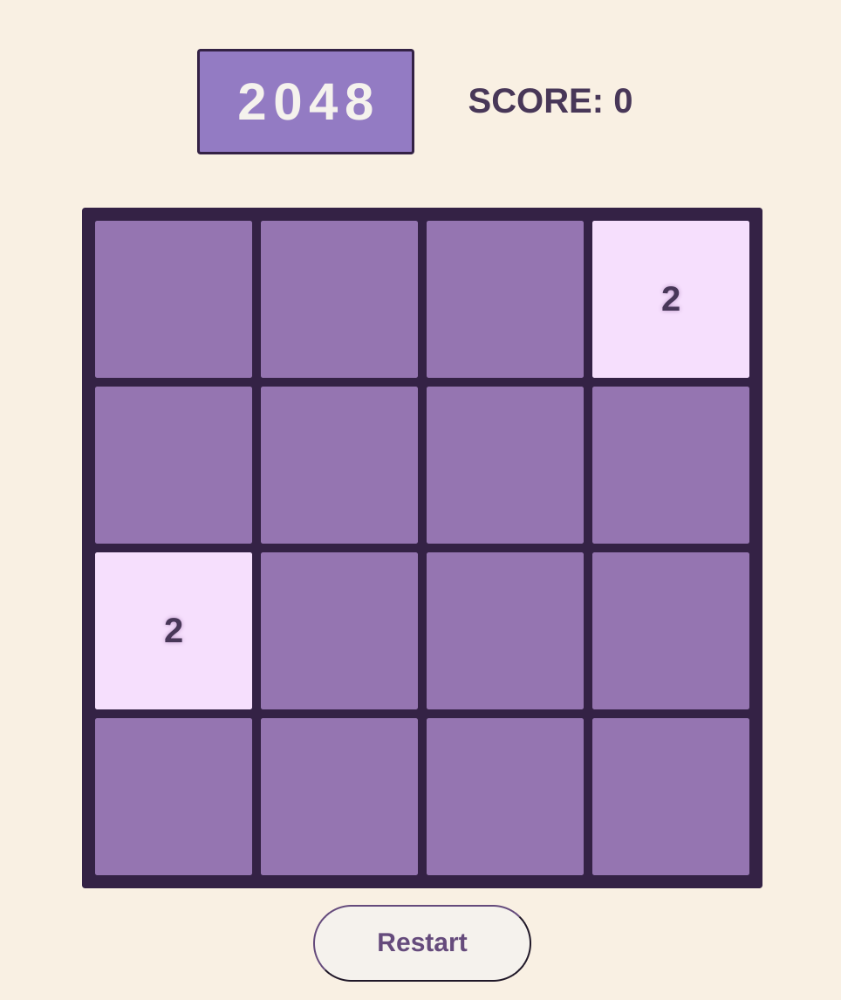
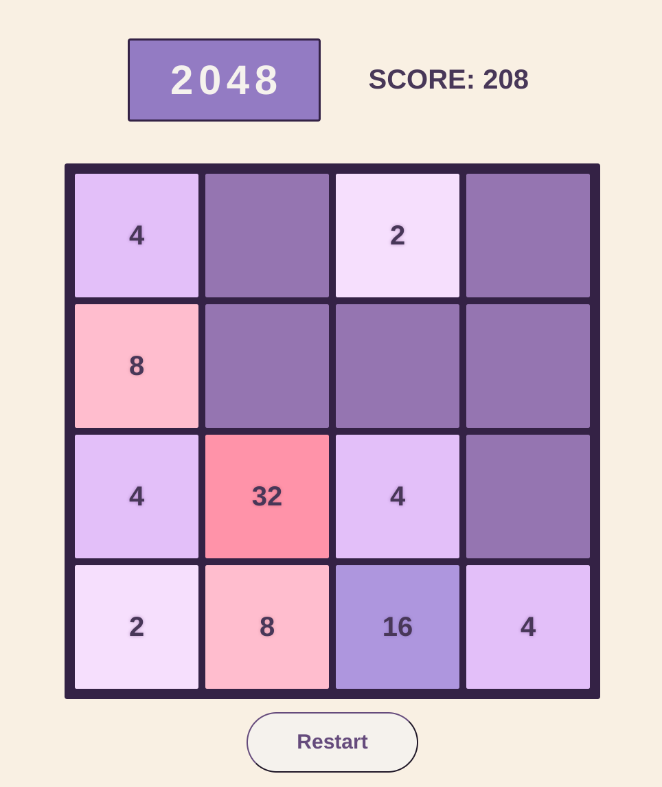

# Globant Piscine FullStack - Project 00: 2048 GAME

This first project is about recreating 2048, a puzzle game you can find [here](https://juego2048.es/), using only HTML, CSS and JavaScript. The goal of the game is to reach 2048 by merging tiles with the same value, starting with values as low as 2 and 4. The challenge comes from only having a 4x4 grid to move the tiles in, which makes you run out of space for moves fast.

---


### Set up
This project is uses docker and so it needs to be launched with:
```
docker-compose build && docker-compose up
```
in the terminal of the project. After building, you need to go to your prefered browser and get into:
```
localhost:8080
```
For cleaning, you need to write in terminal:
```
docker-compose down -v
```
For deep cleaning you need (in case any residue stays in cache):
```
docker-compose down --volumes --remove-orphans && docker volume prune -f && docker system prune -af
```


---
game at the start with score 0 | middle of the game
:-------------------------:|:-------------------------:
 | 


